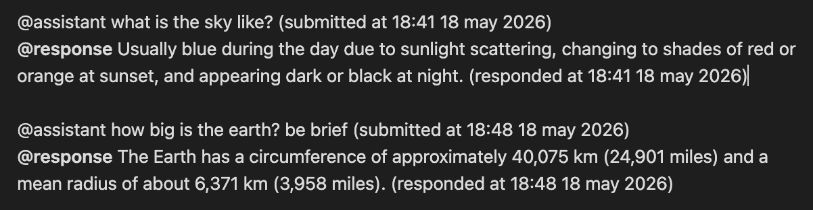

# Inline AI Tutor and Assistant Plugin

## Installation
1. unzip or git clone into the \<vault>/.obsidian/plugins/\<the folder goes here>
2. if cloning, then do an npm run build
3. open obsidian -> settings -> community plugins -> TURN ON community plugins
4. switch on the "Inline AI Tutor+Assistant Plugin"

## Usage
1. set the correct url and model name in the settings tab (open settings and see the plugin name in the left side pane.)
2. url should just be the http(s)://IP_ADDRESS or URI:PORT (v1/chat/completions is added automatically) so if doing local then it is probably http://127.0.0.1:8xxx
3. The LLM query interface is triggered by typing @assistant at the start of a fresh paragraph. There must be a an empty line between typing @assistant and any other content.
4. CMD/CTRL + SHIFT + L is the default hot key to submit (when the button is visible)
5. you can control the amount of context that the model has access to:
    1. @assistant:isolated -> no document context. 
    2. @assistant:doc -> whole document as context.
    3. @assistant:section -> only the immediate section (identified by the ## Header)
    4. You can choose a default context in the settings.
    5. BE SURE TO NOT ADD ANY SPACE WHEN SPECIFYING CONTEXT. @assistant:doc is not the same as "@assistant: doc" or "@assistant :doc" or "@assistant : doc". only "@assistant:doc" no-spaces will trigger the llm call feature.
6. The plugin supports images too, make sure your model and framework support them.
7. currently lm-studio and llama.cpp are supported.
8. LLM responses are prefixed by **@response**

See this image for an example of correct calling (pardon the dark mode background):
